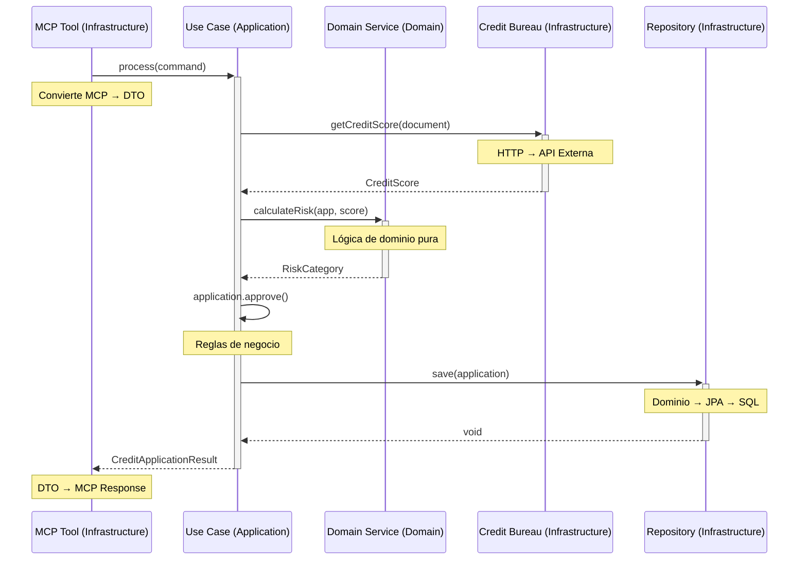

# Diferencias entre Capas Application e Infrastructure en Arquitectura Hexagonal

Una de las confusiones más comunes al implementar Arquitectura Hexagonal es entender la diferencia entre las capas **Application** e **Infrastructure**, ya que ambas parecen "implementar" cosas. Esta guía explica en detalle las diferencias fundamentales, responsabilidades y cuándo usar cada una.

---

## 🎯 **Resumen Ejecutivo**

| **APPLICATION** | **INFRASTRUCTURE** |
|-----------------|-------------------|
| **"QUÉ hacer"** | **"CÓMO hacerlo"** |
| Orquesta casos de uso | Conecta con tecnologías |
| Implementa flujos de trabajo | Implementa puertos técnicos |
| Depende solo de interfaces | Depende de frameworks y APIs |
| Conoce lógica de negocio | Conoce detalles técnicos |

---

## 🚀 **CAPA APPLICATION (Aplicación)**

### **Propósito Principal**
Orquesta la lógica de negocio y coordina el flujo de trabajo de los casos de uso.

### **¿Qué Implementa?**

#### 1. **Use Cases (Casos de Uso)**
Implementa los puertos de entrada (in-ports) definidos en el dominio:

```java
// DOMAIN - Define el contrato (Puerto de Entrada)
public interface ProcessCreditApplicationUseCase {
    CreditApplicationResult process(ProcessCreditApplicationCommand command);
}

// APPLICATION - Implementa la orquestación
@UseCase
public class ProcessCreditApplicationUseCaseImpl implements ProcessCreditApplicationUseCase {
    
    // Solo depende de INTERFACES (puertos de salida)
    private final CreditApplicationRepository repository;        // Interface
    private final CreditBureauPort creditBureau;               // Interface
    private final NotificationPort notificationService;        // Interface
    private final RiskCalculationService riskService;          // Servicio de dominio
    
    @Override
    public CreditApplicationResult process(ProcessCreditApplicationCommand command) {
        // 1. ORQUESTACIÓN: Coordina múltiples servicios
        var application = CreditApplication.create(command);
        
        // 2. DELEGA en servicios de dominio
        var creditScore = creditBureau.getCreditScore(command.documentNumber());
        var risk = riskService.calculateRisk(application, creditScore);
        
        // 3. APLICA reglas de negocio del dominio
        if (risk.isAcceptable()) {
            application.approve();
        } else {
            application.reject("High risk score");
        }
        
        // 4. PERSISTE usando puerto (no sabe CÓMO)
        repository.save(application);
        
        // 5. NOTIFICA usando puerto (no sabe CÓMO)
        notificationService.sendApprovalNotification(application);
        
        return new CreditApplicationResult(application);
    }
}
```

#### 2. **DTOs de Aplicación**
Define objetos de transferencia para la comunicación entre capas:

```java
// Command para casos de uso
public record ProcessCreditApplicationCommand(
    String documentNumber,
    String documentType,
    BigDecimal requestedAmount,
    Integer termMonths,
    VehicleInformationDto vehicle,
    PersonalInformationDto personal
) {
    // Validaciones de estructura, no de negocio
    public ProcessCreditApplicationCommand {
        Objects.requireNonNull(documentNumber, "Document number is required");
        Objects.requireNonNull(requestedAmount, "Requested amount is required");
    }
}

// Result para casos de uso
public record CreditApplicationResult(
    String applicationId,
    String status,
    BigDecimal approvedAmount,
    BigDecimal interestRate,
    Integer termMonths,
    String message
) {}
```

### **Características Clave de APPLICATION**

✅ **Solo depende de interfaces** (puertos de salida)
```java
// ✅ CORRECTO - Depende de interface
private final CreditApplicationRepository repository;

// ❌ INCORRECTO - Dependería de implementación
private final JpaCreditApplicationRepository jpaRepository;
```

✅ **Orquesta servicios de dominio**
```java
// Coordina múltiples servicios para completar un caso de uso
var creditScore = creditBureau.getCreditScore(document);
var vehicleValue = vehicleValuation.getValue(vin);
var risk = riskService.calculateRisk(creditScore, vehicleValue);
```

✅ **No tiene detalles técnicos**
```java
// ✅ CORRECTO - No sabe de HTTP, JPA, JSON
repository.save(application);

// ❌ INCORRECTO - No debería saber de JPA
entityManager.persist(applicationEntity);
```

✅ **Implementa la lógica de casos de uso**
```java
// Define el flujo completo del caso de uso
public CreditApplicationResult process(ProcessCreditApplicationCommand command) {
    // Paso 1: Validar entrada
    // Paso 2: Consultar servicios externos
    // Paso 3: Aplicar reglas de negocio
    // Paso 4: Persistir resultado
    // Paso 5: Notificar resultado
}
```

---

## 🔧 **CAPA INFRASTRUCTURE (Infraestructura)**

### **Propósito Principal**
Conecta el dominio con el mundo exterior proporcionando implementaciones técnicas de los puertos de salida.

### **¿Qué Implementa?**

#### 1. **Implementaciones de Puertos de Salida**

```java
// DOMAIN - Define el contrato (Puerto de Salida)
public interface CreditApplicationRepository {
    void save(CreditApplication application);
    Optional<CreditApplication> findById(CreditApplicationId id);
    List<CreditApplication> findByCustomerId(CustomerId customerId);
}

// INFRASTRUCTURE - Implementa usando tecnología específica
@Repository
public class JpaCreditApplicationRepository implements CreditApplicationRepository {
    
    // DETALLES TÉCNICOS: JPA, Spring Data, SQL
    private final CreditApplicationJpaRepository jpaRepository;
    private final CreditApplicationMapper mapper;
    
    @Override
    public void save(CreditApplication application) {
        // CONVIERTE de dominio a entidad JPA
        CreditApplicationEntity entity = mapper.toEntity(application);
        
        // USA tecnología específica (JPA)
        jpaRepository.save(entity);
        
        // Logging técnico
        log.debug("Saved credit application {} to database", application.getId());
    }
    
    @Override
    public Optional<CreditApplication> findById(CreditApplicationId id) {
        // USA tecnología específica (JPA/SQL)
        return jpaRepository.findById(id.value())
            .map(entity -> {
                // CONVIERTE de JPA a dominio
                var domain = mapper.toDomain(entity);
                log.debug("Retrieved credit application {} from database", id);
                return domain;
            });
    }
}
```

#### 2. **Adaptadores para Servicios Externos**

```java
// DOMAIN - Define el contrato
public interface CreditBureauPort {
    CreditScore getCreditScore(DocumentNumber document);
    CreditHistory getCreditHistory(DocumentNumber document);
}

// INFRASTRUCTURE - Implementa usando HTTP/Feign
@Component
public class HttpCreditBureauAdapter implements CreditBureauPort {
    
    // DETALLES TÉCNICOS: HTTP, Feign, JSON, Circuit Breaker
    private final CreditBureauClient feignClient;
    private final CreditBureauMapper mapper;
    private final CircuitBreaker circuitBreaker;
    
    @Override
    public CreditScore getCreditScore(DocumentNumber document) {
        return circuitBreaker.executeSupplier(() -> {
            // CONVIERTE de dominio a DTO externo
            var request = CreditBureauRequest.builder()
                .documentNumber(document.value())
                .documentType("CC")
                .requestType("SCORE_ONLY")
                .build();
            
            // USA tecnología específica (HTTP/JSON)
            var response = feignClient.getCreditReport(request);
            
            // MANEJA errores técnicos
            if (response.hasError()) {
                throw new CreditBureauException(
                    "Credit bureau error: " + response.getErrorMessage()
                );
            }
            
            // CONVIERTE de DTO externo a dominio
            return new CreditScore(
                response.getScore(),
                response.getScoreDate(),
                response.getProvider()
            );
        });
    }
}
```

#### 3. **Adaptadores MCP**

```java
// INFRASTRUCTURE - Conecta MCP con casos de uso
@Component
public class ProcessCreditApplicationTool {
    
    // DETALLES TÉCNICOS: MCP, JSON, validaciones de entrada
    private final ProcessCreditApplicationUseCase useCase;
    private final McpRequestValidator validator;
    
    @McpTool(
        name = "process_credit_application",
        description = "Procesa una nueva solicitud de crédito automotriz"
    )
    public CreditApplicationResult process(
        @McpParameter(name = "document_number", required = true) String documentNumber,
        @McpParameter(name = "document_type", required = true) String documentType,
        @McpParameter(name = "requested_amount", required = true) BigDecimal requestedAmount,
        @McpParameter(name = "term_months", required = true) Integer termMonths,
        @McpParameter(name = "vehicle_info", required = true) McpVehicleInfo vehicleInfo,
        @McpParameter(name = "personal_info", required = true) McpPersonalInfo personalInfo
    ) {
        // VALIDACIONES técnicas de entrada
        validator.validateMcpRequest(documentNumber, documentType, requestedAmount);
        
        // CONVIERTE de formato MCP a formato de aplicación
        var command = ProcessCreditApplicationCommand.builder()
            .documentNumber(documentNumber)
            .documentType(documentType)
            .requestedAmount(requestedAmount)
            .termMonths(termMonths)
            .vehicle(mapVehicleInfo(vehicleInfo))
            .personal(mapPersonalInfo(personalInfo))
            .build();
        
        try {
            // DELEGA al caso de uso
            var result = useCase.process(command);
            
            // LOGGING técnico
            log.info("Credit application processed via MCP: {}", result.applicationId());
            
            return result;
            
        } catch (Exception e) {
            // MANEJO de errores técnicos
            log.error("Error processing credit application via MCP", e);
            throw new McpProcessingException("Failed to process credit application", e);
        }
    }
}
```

### **Características Clave de INFRASTRUCTURE**

✅ **Implementa interfaces definidas en el dominio**
```java
// Implementa contratos del dominio usando tecnologías específicas
public class JpaCreditApplicationRepository implements CreditApplicationRepository
public class HttpCreditBureauAdapter implements CreditBureauPort
public class SmtpNotificationAdapter implements NotificationPort
```

✅ **Contiene todos los detalles técnicos**
```java
// Conoce JPA, SQL, HTTP, JSON, etc.
@Entity
@Table(name = "credit_applications")
public class CreditApplicationEntity {
    @Id
    @GeneratedValue(strategy = GenerationType.UUID)
    private String id;
    
    @Column(name = "requested_amount", precision = 19, scale = 2)
    private BigDecimal requestedAmount;
    
    @Enumerated(EnumType.STRING)
    @Column(name = "status", length = 50)
    private ApplicationStatusEntity status;
}
```

✅ **Se conecta con el mundo exterior**
```java
// HTTP Clients
@FeignClient(name = "credit-bureau", url = "${external.credit-bureau.url}")
public interface CreditBureauClient { ... }

// Database connections
@Repository
public interface CreditApplicationJpaRepository extends JpaRepository<...> { ... }

// Message queues
@RabbitListener(queues = "credit.notifications")
public void handleNotification(NotificationMessage message) { ... }
```

✅ **Hace conversiones entre formatos**
```java
// Dominio ↔ JPA
@Mapper
public interface CreditApplicationMapper {
    CreditApplicationEntity toEntity(CreditApplication domain);
    CreditApplication toDomain(CreditApplicationEntity entity);
}

// Dominio ↔ API Externa
@Mapper
public interface CreditBureauMapper {
    CreditBureauRequest toExternalRequest(DocumentNumber document);
    CreditScore toDomainCreditScore(CreditBureauResponse response);
}
```

---

## 📊 **Comparación Detallada**

### **Dependencias**

```java
// APPLICATION - Solo interfaces
@UseCase
public class ProcessCreditApplicationUseCaseImpl {
    private final CreditApplicationRepository repository;        // Interface
    private final CreditBureauPort creditBureau;               // Interface
    private final NotificationPort notificationService;        // Interface
    private final RiskCalculationService riskService;          // Domain Service
}

// INFRASTRUCTURE - Tecnologías concretas
@Repository
public class JpaCreditApplicationRepository {
    private final CreditApplicationJpaRepository jpaRepository;  // Spring Data JPA
    private final EntityManager entityManager;                  // JPA
    private final CreditApplicationMapper mapper;               // MapStruct
}
```

### **Testing**

```java
// APPLICATION - Tests con mocks
@Test
void shouldProcessCreditApplicationSuccessfully() {
    // Given - Mocks de interfaces
    when(repository.save(any())).thenReturn(savedApplication);
    when(creditBureau.getCreditScore(any())).thenReturn(goodScore);
    
    // When - Lógica pura
    var result = useCase.process(command);
    
    // Then - Verificación de lógica
    assertThat(result.isApproved()).isTrue();
    verify(repository).save(any());
}

// INFRASTRUCTURE - Tests de integración
@DataJpaTest
void shouldSaveAndRetrieveCreditApplication() {
    // Given - Base de datos real (H2)
    var application = createTestApplication();
    
    // When - Operación real
    repository.save(application);
    var retrieved = repository.findById(application.getId());
    
    // Then - Verificación de persistencia
    assertThat(retrieved).isPresent();
    assertThat(retrieved.get().getAmount()).isEqualTo(application.getAmount());
}
```

### **Cuándo Cambian**

```java
// APPLICATION cambia cuando:
// - Cambian reglas de negocio
// - Se agregan nuevos casos de uso
// - Se modifican flujos de trabajo

// Ejemplo: Nueva regla de negocio
public CreditApplicationResult process(ProcessCreditApplicationCommand command) {
    // NUEVA REGLA: Verificar empleo antes que score crediticio
    var employment = employmentVerification.verify(command.documentNumber());
    if (!employment.isStable()) {
        return CreditApplicationResult.rejected("Unstable employment");
    }
    
    var creditScore = creditBureau.getCreditScore(command.documentNumber());
    // ... resto del flujo
}
```

```java
// INFRASTRUCTURE cambia cuando:
// - Cambian tecnologías (JPA → MongoDB)
// - Cambian APIs externas
// - Se agregan nuevos adaptadores

// Ejemplo: Cambio de JPA a MongoDB
@Repository
public class MongoCreditApplicationRepository implements CreditApplicationRepository {
    
    private final MongoTemplate mongoTemplate;  // Nueva tecnología
    private final CreditApplicationMapper mapper;
    
    @Override
    public void save(CreditApplication application) {
        var document = mapper.toDocument(application);  // Nueva conversión
        mongoTemplate.save(document, "credit_applications");  // Nueva API
    }
}
```

---

## 🔄 **Flujo de Interacción**

### **Secuencia Completa: Procesar Solicitud de Crédito**



### **Responsabilidades en el Flujo**

1. **MCP Tool (Infrastructure)**:
   - Recibe request MCP
   - Valida formato de entrada
   - Convierte MCP → DTO Application
   - Maneja errores técnicos MCP

2. **Use Case (Application)**:
   - Orquesta el flujo completo
   - Coordina servicios de dominio
   - Aplica reglas de negocio
   - No sabe de detalles técnicos

3. **Domain Services (Domain)**:
   - Ejecuta lógica de negocio pura
   - Sin dependencias externas
   - Algoritmos de negocio complejos

4. **Adapters (Infrastructure)**:
   - Conectan con sistemas externos
   - Manejan protocolos específicos
   - Convierten formatos de datos
   - Gestionan errores técnicos

---

## 🎯 **Principios Clave para Recordar**

### **APPLICATION Layer**
- ✅ **Orquesta**, no implementa detalles
- ✅ **Depende solo de interfaces**
- ✅ **Contiene la lógica de casos de uso**
- ✅ **Es independiente de tecnología**
- ❌ **No sabe de HTTP, JPA, JSON, etc.**

### **INFRASTRUCTURE Layer**
- ✅ **Implementa interfaces del dominio**
- ✅ **Contiene detalles técnicos**
- ✅ **Se conecta con el mundo exterior**
- ✅ **Maneja conversiones de formato**
- ❌ **No contiene lógica de negocio**

### **Regla de Oro**
```
Si una clase necesita conocer detalles de HTTP, JPA, JSON, o cualquier
tecnología específica → va en INFRASTRUCTURE

Si una clase solo coordina servicios de dominio y aplica reglas de 
negocio → va en APPLICATION
```

---

## 📚 **Ejemplo Completo: Validación de Documentos**

### **Domain (Puerto)**
```java
public interface DocumentValidationPort {
    ValidationResult validate(DocumentNumber document, DocumentType type);
}
```

### **Application (Uso del Puerto)**
```java
@UseCase
public class ValidateCustomerDocumentsUseCaseImpl implements ValidateCustomerDocumentsUseCase {
    
    private final DocumentValidationPort documentValidator;  // Interface
    
    @Override
    public DocumentValidationResult validate(ValidateDocumentsCommand command) {
        // ORQUESTACIÓN: No sabe CÓMO validar, solo QUÉ validar
        var results = command.documents().stream()
            .map(doc -> documentValidator.validate(doc.number(), doc.type()))
            .toList();
        
        // LÓGICA DE NEGOCIO: Decidir si el conjunto es válido
        boolean allValid = results.stream().allMatch(ValidationResult::isValid);
        
        return new DocumentValidationResult(results, allValid);
    }
}
```

### **Infrastructure (Implementación del Puerto)**
```java
@Component
public class ExternalDocumentValidationAdapter implements DocumentValidationPort {
    
    private final DocumentValidationClient httpClient;     // Feign Client
    private final DocumentMapper mapper;                   // Converter
    private final CircuitBreaker circuitBreaker;          // Resilience
    
    @Override
    public ValidationResult validate(DocumentNumber document, DocumentType type) {
        return circuitBreaker.executeSupplier(() -> {
            // CONVERSIÓN: Dominio → API Externa
            var request = DocumentValidationRequest.builder()
                .documentNumber(document.value())
                .documentType(type.code())
                .validationType("FULL")
                .build();
            
            // LLAMADA HTTP: Tecnología específica
            var response = httpClient.validateDocument(request);
            
            // MANEJO DE ERRORES técnicos
            if (response.hasError()) {
                throw new DocumentValidationException(response.getErrorMessage());
            }
            
            // CONVERSIÓN: API Externa → Dominio
            return ValidationResult.builder()
                .isValid(response.isValid())
                .message(response.getMessage())
                .validatedAt(response.getTimestamp())
                .build();
        });
    }
}
```

---

## 🔍 **Errores Comunes y Cómo Evitarlos**

### ❌ **Error 1: Lógica de Negocio en Infrastructure**
```java
// INCORRECTO - Lógica de negocio en Infrastructure
@Repository
public class JpaCreditApplicationRepository implements CreditApplicationRepository {
    
    @Override
    public void save(CreditApplication application) {
        // ❌ MAL: Lógica de negocio en Infrastructure
        if (application.getAmount().compareTo(BigDecimal.valueOf(1000000)) > 0) {
            application.requireManagerApproval();
        }
        
        var entity = mapper.toEntity(application);
        jpaRepository.save(entity);
    }
}

// CORRECTO - Lógica en Domain/Application
@UseCase
public class ProcessCreditApplicationUseCaseImpl {
    
    public CreditApplicationResult process(ProcessCreditApplicationCommand command) {
        var application = CreditApplication.create(command);
        
        // ✅ BIEN: Lógica de negocio en Application
        if (application.requiresManagerApproval()) {
            application.requireManagerApproval();
        }
        
        repository.save(application);  // Solo persistencia
    }
}
```

### ❌ **Error 2: Detalles Técnicos en Application**
```java
// INCORRECTO - Detalles técnicos en Application
@UseCase
public class ProcessCreditApplicationUseCaseImpl {
    
    private final RestTemplate restTemplate;  // ❌ MAL: Tecnología específica
    
    public CreditApplicationResult process(ProcessCreditApplicationCommand command) {
        // ❌ MAL: HTTP directo en Application
        var response = restTemplate.postForObject(
            "https://api.creditbureau.com/score",
            request,
            CreditScoreResponse.class
        );
    }
}

// CORRECTO - Solo interfaces en Application
@UseCase
public class ProcessCreditApplicationUseCaseImpl {
    
    private final CreditBureauPort creditBureau;  // ✅ BIEN: Interface
    
    public CreditApplicationResult process(ProcessCreditApplicationCommand command) {
        // ✅ BIEN: Usa puerto, no sabe de HTTP
        var score = creditBureau.getCreditScore(command.documentNumber());
    }
}
```

### ❌ **Error 3: Dependencias Circulares**
```java
// INCORRECTO - Infrastructure depende de Application
@Component
public class HttpCreditBureauAdapter {
    
    private final ProcessCreditApplicationUseCase useCase;  // ❌ MAL: Circular
}

// CORRECTO - Solo Application depende de Infrastructure
@UseCase
public class ProcessCreditApplicationUseCaseImpl {
    
    private final CreditBureauPort creditBureau;  // ✅ BIEN: Interface de Infrastructure
}
```

---

## 📖 **Conclusión**

La diferencia fundamental entre **Application** e **Infrastructure** es:

- **APPLICATION**: Se enfoca en **QUÉ** hacer (orquestación y flujo de casos de uso)
- **INFRASTRUCTURE**: Se enfoca en **CÓMO** hacerlo (implementaciones técnicas)

Esta separación permite:
- ✅ **Testabilidad**: Application se testea con mocks, Infrastructure con tests de integración
- ✅ **Mantenibilidad**: Cambios de tecnología no afectan la lógica de negocio
- ✅ **Flexibilidad**: Fácil intercambio de implementaciones
- ✅ **Claridad**: Cada capa tiene responsabilidades bien definidas

Recordar siempre: **Si necesita conocer detalles técnicos → Infrastructure. Si solo coordina lógica de negocio → Application.**