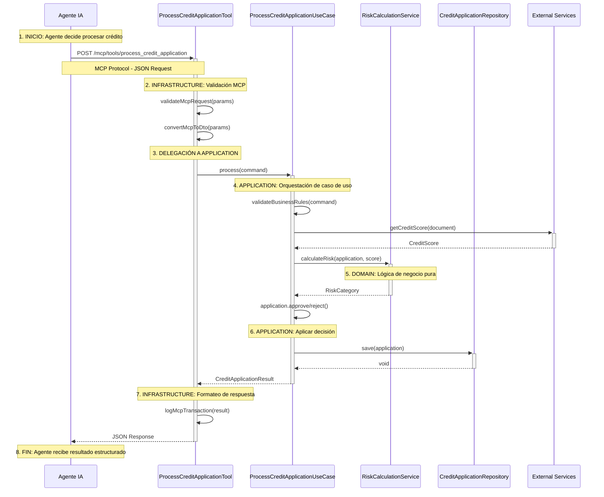
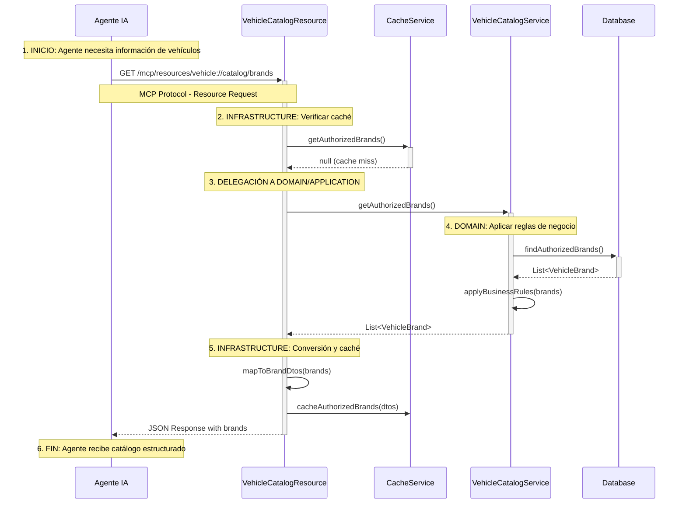
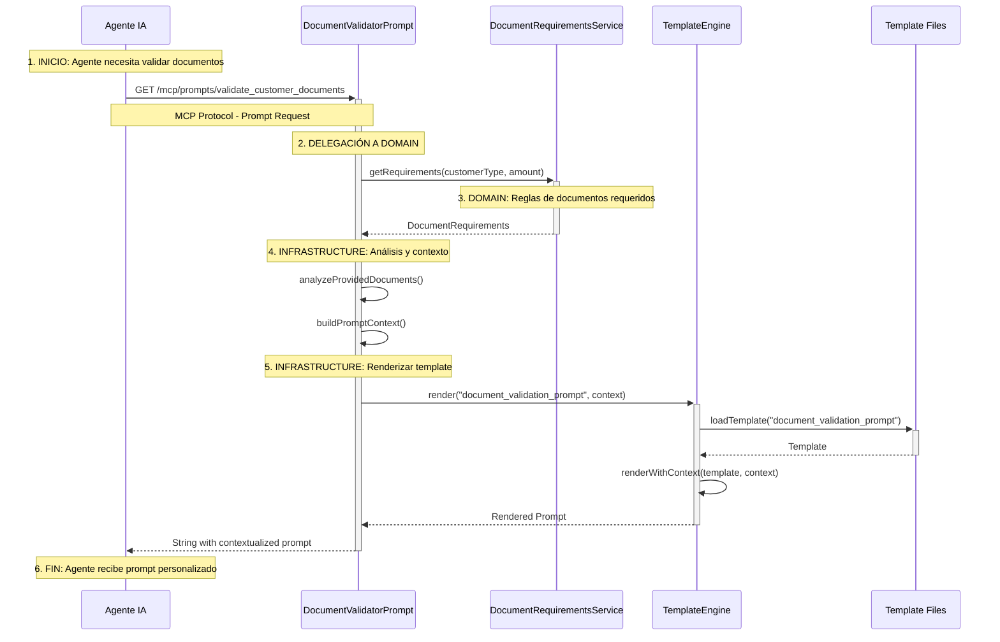

# Responsabilidades de las Capas MCP en Arquitectura Hexagonal

## 🎯 **Conceptos Fundamentales**

En la arquitectura hexagonal, el **Model Context Protocol (MCP)** actúa como un **adaptador de infraestructura** que permite a los agentes de IA interactuar con nuestro sistema de manera estructurada. Es crucial entender que **MCP NO contiene lógica de negocio**, sino que actúa como un **puente** entre el mundo exterior (agentes IA) y nuestro dominio.

### **Principio Clave**
```
MCP = Adaptador de Infraestructura
- Tools: Ejecutan acciones → Delegan a Use Cases
- Resources: Proporcionan datos → Delegan a Services  
- Prompts: Generan templates → Usan información del Domain
```

---

## 🏗️ **Arquitectura MCP en Capas**

```
┌─────────────────────────────────────────────────────────────────┐
│                        AGENTE IA                                │
│          (Claude, ChatGPT, Copilot, etc.)                      │
└─────────────────────┬───────────────────────────────────────────┘
                      │ MCP Protocol
                      ▼
┌─────────────────────────────────────────────────────────────────┐
│                   INFRASTRUCTURE LAYER                         │
├─────────────────────────────────────────────────────────────────┤
│  MCP ADAPTERS:                                                  │
│  ┌─────────────┐  ┌─────────────┐  ┌─────────────┐             │
│  │    TOOLS    │  │  RESOURCES  │  │   PROMPTS   │             │
│  │             │  │             │  │             │             │
│  │ @McpTool    │  │ @McpResource│  │ @McpPrompt  │             │
│  │ HTTP/JSON   │  │ Data Access │  │ Templates   │             │
│  │ Validation  │  │ Formatting  │  │ Generation  │             │
│  │ Conversion  │  │ Caching     │  │ Rendering   │             │
│  └─────────────┘  └─────────────┘  └─────────────┘             │
│         │                 │                 │                   │
│         ▼                 ▼                 ▼                   │
└─────────────────────────────────────────────────────────────────┘
          │                 │                 │
          ▼                 ▼                 ▼
┌─────────────────────────────────────────────────────────────────┐
│                   APPLICATION LAYER                             │
├─────────────────────────────────────────────────────────────────┤
│  USE CASES (Orquestación):                                     │
│  ┌─────────────────────────────────────────────────────────────┐ │
│  │ ProcessCreditApplicationUseCase                             │ │
│  │ ValidateCustomerDocumentsUseCase                           │ │
│  │ GetCreditApplicationStatusUseCase                          │ │
│  │ CalculateInterestRatesUseCase                              │ │
│  └─────────────────────────────────────────────────────────────┘ │
│         │                 │                 │                   │
│         ▼                 ▼                 ▼                   │
└─────────────────────────────────────────────────────────────────┘
          │                 │                 │
          ▼                 ▼                 ▼
┌─────────────────────────────────────────────────────────────────┐
│                      DOMAIN LAYER                               │
├─────────────────────────────────────────────────────────────────┤
│  BUSINESS LOGIC:                                                │
│  ┌─────────────────────────────────────────────────────────────┐ │
│  │ Entities: CreditApplication, Customer, Vehicle             │ │
│  │ Services: RiskCalculationService, InterestRateService      │ │
│  │ Value Objects: CreditAmount, DocumentNumber, VIN           │ │
│  │ Rules: Business validation, Credit policies                │ │
│  └─────────────────────────────────────────────────────────────┘ │
└─────────────────────────────────────────────────────────────────┘
```

---

## 🔧 **Responsabilidades por Tipo de Adaptador MCP**

### **1. MCP TOOLS (Herramientas)**

#### **Responsabilidad: Ejecutar Acciones**
Las herramientas MCP son **puntos de entrada** que permiten a los agentes IA ejecutar acciones específicas en el sistema.

#### **¿Qué Hacen las Tools?**
- ✅ **Reciben parámetros** del agente IA (HTTP/JSON)
- ✅ **Validan entrada** (formato, tipos, requeridos)
- ✅ **Convierten formatos** (MCP → DTOs de aplicación)
- ✅ **Delegan a Use Cases** (NO ejecutan lógica de negocio)
- ✅ **Manejan errores técnicos** (MCP, serialización)
- ✅ **Formatean respuesta** (DTOs → JSON MCP)

#### **¿Qué NO Hacen las Tools?**
- ❌ **NO contienen lógica de negocio**
- ❌ **NO calculan riesgos, tasas o aprobaciones**
- ❌ **NO validan reglas de negocio**
- ❌ **NO manejan persistencia directamente**

#### **Ejemplo: ProcessCreditApplicationTool**

```java
@Component
public class ProcessCreditApplicationTool {
    
    // DEPENDENCIA: Solo Use Case (Application Layer)
    private final ProcessCreditApplicationUseCase processUseCase;
    private final McpRequestValidator validator;  // Validación técnica
    
    @McpTool(
        name = "process_credit_application",
        description = "Procesa una nueva solicitud de crédito automotriz"
    )
    public CreditApplicationResult process(
        @McpParameter(name = "document_number") String documentNumber,
        @McpParameter(name = "requested_amount") BigDecimal requestedAmount,
        @McpParameter(name = "term_months") Integer termMonths,
        @McpParameter(name = "vehicle_info") McpVehicleInfo vehicleInfo
    ) {
        try {
            // 1. INFRAESTRUCTURA: Validación técnica de entrada MCP
            validator.validateMcpRequest(documentNumber, requestedAmount);
            
            // 2. INFRAESTRUCTURA: Conversión MCP → DTO Application
            var command = ProcessCreditApplicationCommand.builder()
                .documentNumber(documentNumber)
                .requestedAmount(requestedAmount)
                .termMonths(termMonths)
                .vehicle(mapToVehicleDto(vehicleInfo))  // Conversión técnica
                .build();
            
            // 3. DELEGACIÓN: Toda la lógica va al Use Case
            var result = processUseCase.process(command);
            
            // 4. INFRAESTRUCTURA: Logging técnico
            log.info("Credit application processed via MCP: {}", result.applicationId());
            
            // 5. INFRAESTRUCTURA: Return directo (sin transformación adicional)
            return result;
            
        } catch (ValidationException e) {
            // 6. INFRAESTRUCTURA: Manejo de errores técnicos MCP
            log.error("MCP validation error: {}", e.getMessage());
            throw new McpProcessingException("Invalid request parameters", e);
        } catch (Exception e) {
            // 7. INFRAESTRUCTURA: Manejo de errores generales
            log.error("Error processing credit application via MCP", e);
            throw new McpProcessingException("Failed to process credit application", e);
        }
    }
    
    // INFRAESTRUCTURA: Conversión de formatos MCP
    private VehicleInformationDto mapToVehicleDto(McpVehicleInfo mcpInfo) {
        return VehicleInformationDto.builder()
            .brand(mcpInfo.getBrand())
            .model(mcpInfo.getModel())
            .year(mcpInfo.getYear())
            .vin(mcpInfo.getVin())
            .build();
    }
}
```

---

### **2. MCP RESOURCES (Recursos)**

#### **Responsabilidad: Proporcionar Datos Estructurados**
Los recursos MCP exponen **información del sistema** que los agentes IA pueden consultar para tomar decisiones informadas.

#### **¿Qué Hacen los Resources?**
- ✅ **Exponen datos** del dominio como URIs MCP
- ✅ **Formatean información** para consumo de IA
- ✅ **Cachean datos** frecuentemente consultados
- ✅ **Aplican filtros** y paginación
- ✅ **Convierten formatos** (Domain → DTOs → JSON MCP)

#### **¿Qué NO Hacen los Resources?**
- ❌ **NO modifican datos** (solo lectura)
- ❌ **NO contienen lógica de negocio**
- ❌ **NO ejecutan cálculos complejos**
- ❌ **NO manejan transacciones**

#### **Ejemplo: VehicleCatalogResource**

```java
@Component
public class VehicleCatalogResource {
    
    // DEPENDENCIAS: Services de consulta, NO Use Cases
    private final VehicleCatalogService catalogService;  // Domain/Application
    private final VehicleCacheService cacheService;     // Infrastructure
    
    @McpResource(
        uri = "vehicle://catalog/brands",
        name = "Catálogo de Marcas de Vehículos",
        description = "Lista completa de marcas autorizadas para crédito"
    )
    public List<VehicleBrandDto> getAuthorizedBrands() {
        // 1. INFRAESTRUCTURA: Verificar caché
        var cached = cacheService.getAuthorizedBrands();
        if (cached != null) {
            log.debug("Returning cached vehicle brands");
            return cached;
        }
        
        // 2. DELEGACIÓN: Obtener datos del servicio de dominio
        var brands = catalogService.getAuthorizedBrands();
        
        // 3. INFRAESTRUCTURA: Conversión Domain → DTO
        var brandDtos = brands.stream()
            .map(this::mapToBrandDto)
            .sorted(Comparator.comparing(VehicleBrandDto::getName))
            .toList();
        
        // 4. INFRAESTRUCTURA: Cachear resultado
        cacheService.cacheAuthorizedBrands(brandDtos);
        
        // 5. INFRAESTRUCTURA: Logging
        log.debug("Returning {} authorized vehicle brands", brandDtos.size());
        
        return brandDtos;
    }
    
    @McpResource(
        uri = "vehicle://catalog/models/{brand}",
        name = "Modelos por Marca",
        description = "Lista de modelos disponibles para una marca específica"
    )
    public List<VehicleModelDto> getModelsByBrand(
        @McpParameter(name = "brand") String brand,
        @McpParameter(name = "year", required = false) Integer year
    ) {
        // 1. INFRAESTRUCTURA: Validación de parámetros
        if (brand == null || brand.trim().isEmpty()) {
            throw new McpResourceException("Brand parameter is required");
        }
        
        // 2. DELEGACIÓN: Consultar servicio de dominio
        var models = year != null ? 
            catalogService.getModelsByBrandAndYear(brand, year) :
            catalogService.getModelsByBrand(brand);
        
        // 3. INFRAESTRUCTURA: Conversión y formateo
        return models.stream()
            .map(this::mapToModelDto)
            .sorted(Comparator.comparing(VehicleModelDto::getName))
            .toList();
    }
    
    // INFRAESTRUCTURA: Métodos de conversión
    private VehicleBrandDto mapToBrandDto(VehicleBrand brand) {
        return VehicleBrandDto.builder()
            .code(brand.getCode())
            .name(brand.getName())
            .authorized(brand.isAuthorized())
            .minYear(brand.getMinYear())
            .maxLtvRatio(brand.getMaxLtvRatio())
            .build();
    }
}
```

---

### **3. MCP PROMPTS (Templates)**

#### **Responsabilidad: Generar Templates Contextuales**
Los prompts MCP generan **templates estructurados** que guían las conversaciones entre agentes IA y usuarios.

#### **¿Qué Hacen los Prompts?**
- ✅ **Generan templates** dinámicos basados en contexto
- ✅ **Incluyen datos** del dominio en templates
- ✅ **Formatean instrucciones** para agentes IA
- ✅ **Renderizan contenido** con engines de templates
- ✅ **Personalizan mensajes** según usuario/contexto

#### **¿Qué NO Hacen los Prompts?**
- ❌ **NO ejecutan lógica de negocio**
- ❌ **NO modifican datos**
- ❌ **NO toman decisiones de negocio**
- ❌ **NO persisten información**

#### **Ejemplo: DocumentValidatorPrompt**

```java
@Component
public class DocumentValidatorPrompt {
    
    // DEPENDENCIAS: Services de consulta y templates
    private final DocumentRequirementsService requirementsService;  // Domain
    private final PromptTemplateEngine templateEngine;              // Infrastructure
    
    @McpPrompt(
        name = "validate_customer_documents",
        description = "Genera prompt para validar documentos de cliente"
    )
    public String createValidationPrompt(
        @McpParameter(name = "customer_type") String customerType,
        @McpParameter(name = "credit_amount") BigDecimal creditAmount,
        @McpParameter(name = "documents") List<DocumentDto> providedDocuments
    ) {
        // 1. DELEGACIÓN: Obtener requerimientos del dominio
        var requirements = requirementsService.getRequirements(customerType, creditAmount);
        
        // 2. INFRAESTRUCTURA: Análisis de documentos proporcionados
        var analysis = analyzeProvidedDocuments(providedDocuments, requirements);
        
        // 3. INFRAESTRUCTURA: Construcción de contexto para template
        var context = PromptContext.builder()
            .customerType(customerType)
            .creditAmount(formatCurrency(creditAmount))
            .requiredDocuments(mapToRequiredDocs(requirements))
            .providedDocuments(mapToProvidedDocs(providedDocuments))
            .missingDocuments(analysis.getMissingDocuments())
            .invalidDocuments(analysis.getInvalidDocuments())
            .validationRules(mapToValidationRules(requirements))
            .build();
        
        // 4. INFRAESTRUCTURA: Renderizar template
        return templateEngine.render("document_validation_prompt", context);
    }
    
    @McpPrompt(
        name = "risk_assessment_guidance",
        description = "Genera prompt para evaluación de riesgo crediticio"
    )
    public String createRiskAssessmentPrompt(
        @McpParameter(name = "application_id") String applicationId
    ) {
        // 1. DELEGACIÓN: Obtener datos de la aplicación
        var application = applicationService.getApplicationSummary(applicationId);
        var riskFactors = riskService.identifyRiskFactors(application);
        
        // 2. INFRAESTRUCTURA: Construcción de contexto
        var context = RiskPromptContext.builder()
            .applicationId(applicationId)
            .customerProfile(mapToCustomerProfile(application.getCustomer()))
            .vehicleInfo(mapToVehicleInfo(application.getVehicle()))
            .financialInfo(mapToFinancialInfo(application))
            .riskFactors(mapToRiskFactors(riskFactors))
            .evaluationCriteria(getRiskEvaluationCriteria())
            .build();
        
        // 3. INFRAESTRUCTURA: Renderizar template específico
        return templateEngine.render("risk_assessment_prompt", context);
    }
    
    // INFRAESTRUCTURA: Análisis de documentos
    private DocumentAnalysis analyzeProvidedDocuments(
        List<DocumentDto> provided, 
        DocumentRequirements requirements
    ) {
        var missing = requirements.getRequiredDocuments().stream()
            .filter(req -> provided.stream()
                .noneMatch(doc -> doc.getType().equals(req.getType())))
            .toList();
            
        var invalid = provided.stream()
            .filter(doc -> !isValidDocument(doc, requirements))
            .toList();
            
        return DocumentAnalysis.builder()
            .missingDocuments(missing)
            .invalidDocuments(invalid)
            .build();
    }
}
```

---

## 🔄 **Flujo Completo: Interacción Agente con MCP**

### **Secuencia: Procesar Solicitud de Crédito via MCP**



### **Secuencia: Consultar Catálogo de Vehículos via MCP**



### **Secuencia: Generar Prompt de Validación via MCP**



---

## 🎯 **Responsabilidades por Capa en MCP**

### **DOMAIN LAYER con MCP**

**Responsabilidades:**
- ✅ **Define las reglas de negocio** que MCP debe respetar
- ✅ **Proporciona servicios** que MCP puede consultar
- ✅ **Valida entidades** recibidas via MCP
- ✅ **Calcula valores** solicitados por MCP

**NO Responsabilidades:**
- ❌ **NO conoce MCP** (no hay dependencias MCP en Domain)
- ❌ **NO maneja protocolos** MCP
- ❌ **NO formatea respuestas** MCP

```java
// DOMAIN - Servicio puro de negocio
@Service
public class RiskCalculationService {
    
    // ✅ BIEN: Lógica de negocio pura, agnóstica de MCP
    public RiskCategory calculateRisk(CreditApplication application, CreditScore score) {
        // Algoritmo complejo de evaluación de riesgo
        // Sin conocimiento de MCP, HTTP, JSON, etc.
        
        if (score.getValue() >= EXCELLENT_THRESHOLD) {
            return RiskCategory.LOW;
        }
        
        var debtToIncomeRatio = calculateDebtToIncomeRatio(application);
        if (debtToIncomeRatio.compareTo(MAX_DEBT_TO_INCOME) > 0) {
            return RiskCategory.HIGH;
        }
        
        return RiskCategory.MEDIUM;
    }
}
```

### **APPLICATION LAYER con MCP**

**Responsabilidades:**
- ✅ **Orquesta casos de uso** invocados por MCP
- ✅ **Coordina servicios de dominio** para MCP
- ✅ **Aplica reglas de negocio** solicitadas via MCP
- ✅ **Retorna resultados** estructurados para MCP

**NO Responsabilidades:**
- ❌ **NO maneja protocolo MCP** directamente
- ❌ **NO valida formatos MCP**
- ❌ **NO convierte JSON MCP**

```java
// APPLICATION - Use Case que puede ser invocado por MCP
@UseCase
public class ProcessCreditApplicationUseCaseImpl implements ProcessCreditApplicationUseCase {
    
    private final CreditApplicationRepository repository;
    private final CreditBureauPort creditBureau;
    private final RiskCalculationService riskService;
    
    @Override
    public CreditApplicationResult process(ProcessCreditApplicationCommand command) {
        // ✅ BIEN: Orquestación pura, sin conocimiento de MCP
        
        // 1. Crear entidad de dominio
        var application = CreditApplication.create(command);
        
        // 2. Consultar score crediticio
        var creditScore = creditBureau.getCreditScore(command.documentNumber());
        
        // 3. Calcular riesgo usando servicio de dominio
        var risk = riskService.calculateRisk(application, creditScore);
        
        // 4. Aplicar reglas de negocio
        if (risk.isAcceptable()) {
            application.approve();
        } else {
            application.reject("High risk: " + risk.getReason());
        }
        
        // 5. Persistir
        repository.save(application);
        
        // 6. Retornar resultado (será convertido por MCP Tool)
        return CreditApplicationResult.builder()
            .applicationId(application.getId().value())
            .status(application.getStatus().name())
            .approvedAmount(application.getApprovedAmount())
            .message(application.getDecisionMessage())
            .build();
    }
}
```

### **INFRASTRUCTURE LAYER con MCP**

**Responsabilidades:**
- ✅ **Implementa protocolo MCP** (Tools, Resources, Prompts)
- ✅ **Valida entrada MCP** (formatos, tipos, requeridos)
- ✅ **Convierte formatos** (MCP ↔ DTOs)
- ✅ **Maneja errores MCP** (protocolo, serialización)
- ✅ **Delega a Application** (Use Cases)
- ✅ **Logging y observabilidad** MCP

**NO Responsabilidades:**
- ❌ **NO contiene lógica de negocio**
- ❌ **NO toma decisiones de negocio**
- ❌ **NO calcula riesgos o tasas**

```java
// INFRASTRUCTURE - Adaptador MCP que delega a Application
@Component
public class ProcessCreditApplicationTool {
    
    // ✅ BIEN: Solo depende de Use Case (Application)
    private final ProcessCreditApplicationUseCase processUseCase;
    
    @McpTool(name = "process_credit_application")
    public CreditApplicationResult process(
        @McpParameter(name = "document_number") String documentNumber,
        @McpParameter(name = "requested_amount") BigDecimal requestedAmount
    ) {
        // ✅ BIEN: Responsabilidades de Infrastructure
        
        // 1. Validación técnica MCP
        validateMcpParameters(documentNumber, requestedAmount);
        
        // 2. Conversión MCP → DTO Application  
        var command = ProcessCreditApplicationCommand.builder()
            .documentNumber(documentNumber)
            .requestedAmount(requestedAmount)
            .build();
        
        // 3. Delegación completa a Application (SIN lógica de negocio)
        var result = processUseCase.process(command);
        
        // 4. Logging técnico
        log.info("Credit application {} processed via MCP", result.applicationId());
        
        // 5. Return directo (MCP maneja serialización)
        return result;
    }
    
    // ✅ BIEN: Validación técnica, no de negocio
    private void validateMcpParameters(String documentNumber, BigDecimal amount) {
        if (documentNumber == null || documentNumber.trim().isEmpty()) {
            throw new McpValidationException("Document number is required");
        }
        if (amount == null || amount.compareTo(BigDecimal.ZERO) <= 0) {
            throw new McpValidationException("Amount must be positive");
        }
    }
}
```

---

## 📚 **Ejemplos de Errores Comunes y Cómo Evitarlos**

### ❌ **Error 1: Lógica de Negocio en MCP Tool**

```java
// ❌ INCORRECTO - Lógica de negocio en Infrastructure
@Component
public class ProcessCreditApplicationTool {
    
    @McpTool(name = "process_credit_application")
    public CreditApplicationResult process(String documentNumber, BigDecimal amount) {
        
        // ❌ MAL: Cálculo de riesgo en MCP Tool
        if (amount.compareTo(BigDecimal.valueOf(1000000)) > 0) {
            return CreditApplicationResult.rejected("Amount too high");
        }
        
        // ❌ MAL: Consulta directa a servicios externos
        var creditScore = creditBureauClient.getScore(documentNumber);
        if (creditScore < 600) {
            return CreditApplicationResult.rejected("Poor credit score");
        }
        
        // ❌ MAL: Persistencia directa
        repository.save(new CreditApplication(documentNumber, amount));
        
        return CreditApplicationResult.approved();
    }
}
```

```java
// ✅ CORRECTO - Solo adaptación MCP
@Component
public class ProcessCreditApplicationTool {
    
    private final ProcessCreditApplicationUseCase processUseCase;
    
    @McpTool(name = "process_credit_application")
    public CreditApplicationResult process(String documentNumber, BigDecimal amount) {
        
        // ✅ BIEN: Solo conversión y delegación
        var command = ProcessCreditApplicationCommand.builder()
            .documentNumber(documentNumber)
            .requestedAmount(amount)
            .build();
        
        // ✅ BIEN: Toda la lógica en Use Case
        return processUseCase.process(command);
    }
}
```

### ❌ **Error 2: MCP Resource Modificando Datos**

```java
// ❌ INCORRECTO - Resource modificando estado
@Component
public class VehicleCatalogResource {
    
    @McpResource(uri = "vehicle://catalog/update-prices")
    public List<VehicleDto> updateVehiclePrices() {
        // ❌ MAL: Resources no deben modificar datos
        vehicleService.updateAllPrices();
        return vehicleService.getAllVehicles();
    }
}
```

```java
// ✅ CORRECTO - Resource solo lee datos
@Component
public class VehicleCatalogResource {
    
    @McpResource(uri = "vehicle://catalog/current-prices")
    public List<VehicleDto> getCurrentPrices() {
        // ✅ BIEN: Solo consulta y retorna datos
        return vehicleService.getAllVehicles();
    }
}

// ✅ CORRECTO - Modificación va en Tool
@Component
public class UpdateVehiclePricesTool {
    
    @McpTool(name = "update_vehicle_prices")
    public UpdateResult updatePrices() {
        // ✅ BIEN: Tools pueden modificar datos
        return updateVehiclePricesUseCase.updateAll();
    }
}
```

### ❌ **Error 3: Prompt con Lógica de Negocio**

```java
// ❌ INCORRECTO - Lógica de negocio en Prompt
@Component
public class RiskAssessmentPrompt {
    
    @McpPrompt(name = "risk_assessment")
    public String createPrompt(String applicationId) {
        
        // ❌ MAL: Cálculo de riesgo en Prompt
        var application = getApplication(applicationId);
        var riskScore = calculateRiskScore(application);  // Lógica de negocio
        
        if (riskScore > 80) {
            return "This application is HIGH RISK. Reject immediately.";
        }
        
        return "Medium risk application.";
    }
}
```

```java
// ✅ CORRECTO - Prompt solo genera templates
@Component
public class RiskAssessmentPrompt {
    
    private final RiskAnalysisService riskService;  // Domain service
    private final PromptTemplateEngine templateEngine;
    
    @McpPrompt(name = "risk_assessment")
    public String createPrompt(String applicationId) {
        
        // ✅ BIEN: Delegar cálculo a servicio de dominio
        var riskAnalysis = riskService.analyzeApplication(applicationId);
        
        // ✅ BIEN: Solo construir contexto y renderizar
        var context = PromptContext.builder()
            .applicationId(applicationId)
            .riskCategory(riskAnalysis.getCategory())
            .riskFactors(riskAnalysis.getFactors())
            .recommendations(riskAnalysis.getRecommendations())
            .build();
        
        return templateEngine.render("risk_assessment_template", context);
    }
}
```

---

## 🔍 **Debugging y Observabilidad MCP**

### **Logging por Capa**

```java
// INFRASTRUCTURE - MCP Tool
@McpTool(name = "process_credit_application")
public CreditApplicationResult process(...) {
    log.info("MCP Tool invoked: process_credit_application");
    log.debug("MCP Parameters: documentNumber={}, amount={}", documentNumber, amount);
    
    try {
        var result = processUseCase.process(command);
        log.info("MCP Tool completed successfully: applicationId={}", result.applicationId());
        return result;
    } catch (Exception e) {
        log.error("MCP Tool failed: {}", e.getMessage());
        throw new McpProcessingException("Tool execution failed", e);
    }
}

// APPLICATION - Use Case
@Override
public CreditApplicationResult process(ProcessCreditApplicationCommand command) {
    log.info("Use Case started: ProcessCreditApplication");
    log.debug("Processing credit application for document: {}", command.documentNumber());
    
    // ... lógica de orquestación
    
    log.info("Use Case completed: applicationId={}, status={}", 
             result.applicationId(), result.status());
    return result;
}

// DOMAIN - Service
public RiskCategory calculateRisk(CreditApplication application, CreditScore score) {
    log.debug("Calculating risk for application: {}", application.getId());
    
    // ... lógica de cálculo
    
    log.debug("Risk calculated: category={}, score={}", category, finalScore);
    return category;
}
```

---

## 🎯 **Conclusiones Clave**

### **1. Separación Clara de Responsabilidades**
- **MCP (Infrastructure)**: Protocolo, conversión, validación técnica
- **Application**: Orquestación de casos de uso
- **Domain**: Lógica de negocio pura

### **2. Flujo de Datos Unidireccional**
```
Agente IA → MCP Tool → Use Case → Domain Service → Repository
         ↑                              ↓
   Respuesta MCP ← DTO ← Result ← Domain Entity ← Database
```

### **3. Principios de Diseño**
- ✅ **MCP solo adapta**, nunca decide
- ✅ **Application orquesta**, nunca implementa detalles técnicos  
- ✅ **Domain calcula**, nunca conoce MCP
- ✅ **Cada capa tiene una responsabilidad clara**

### **4. Beneficios de esta Arquitectura**
- 🔧 **Mantenibilidad**: Cambios en MCP no afectan lógica de negocio
- 🧪 **Testabilidad**: Cada capa se testea independientemente
- 🔄 **Flexibilidad**: Fácil cambio de protocolos (MCP → GraphQL → REST)
- 📈 **Escalabilidad**: Agregar nuevas capacidades MCP sin modificar core

Esta arquitectura garantiza que el sistema mantenga su integridad y flexibilidad mientras proporciona interfaces poderosas para agentes de IA a través del Model Context Protocol.